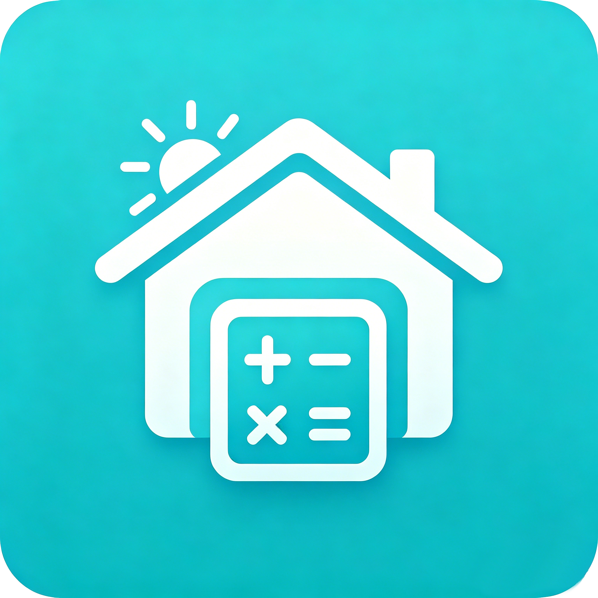
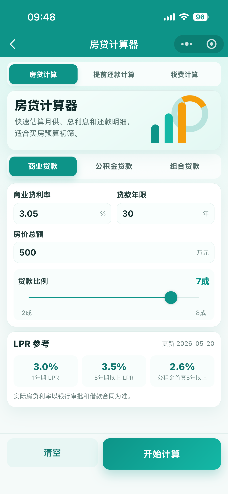
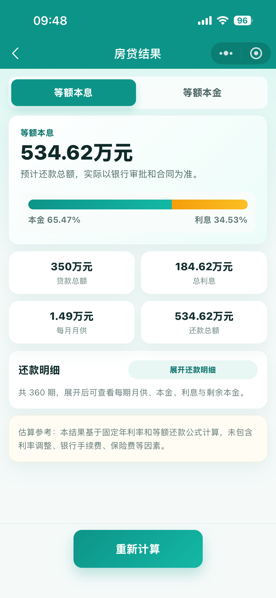
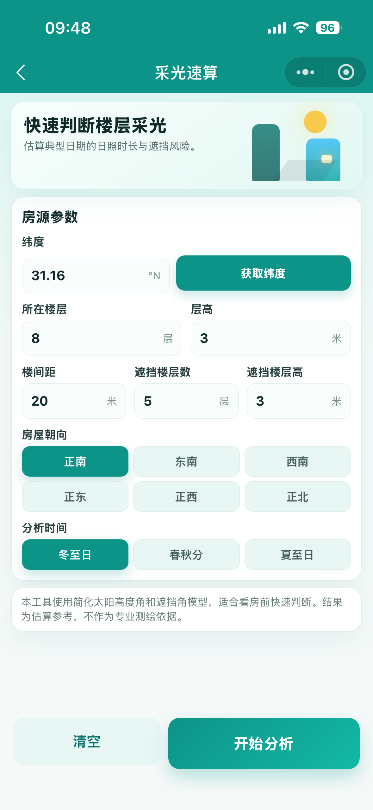
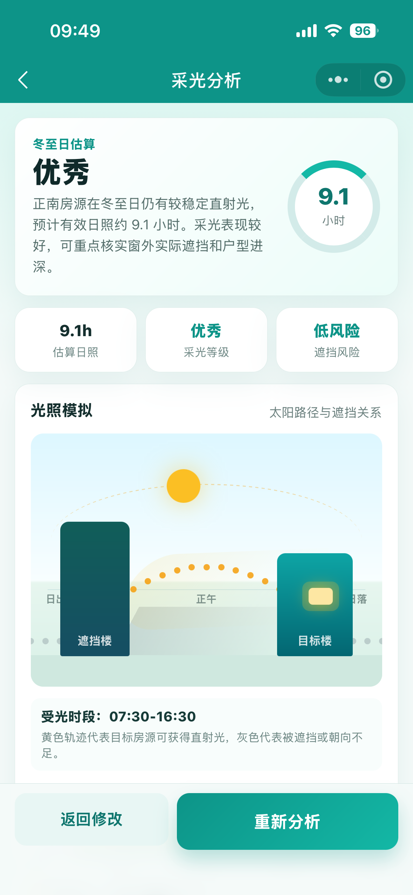
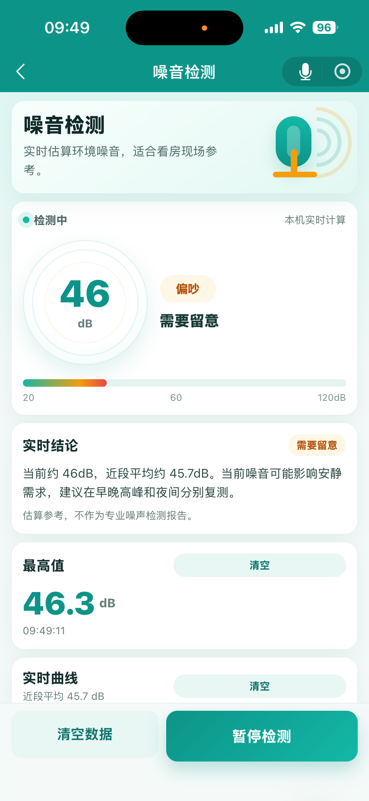
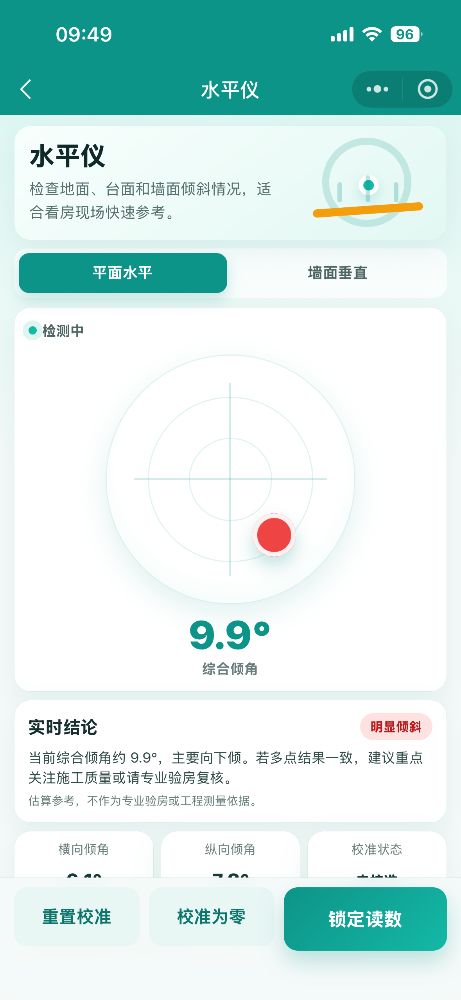

# 买房工具箱

买房工具箱是一款面向买房、看房、选房现场的微信小程序，聚合房贷计算、提前还款、房屋税费、采光分析、扬尘分析、测距仪、噪音检测、水平仪等实用工具。

它的目标很简单：把看房时经常需要临时判断、临时计算的事情，集中放到一个轻量、好用、可信的小程序里。

> 本仓库仅用于产品展示，不包含小程序源代码。

## 立即体验

微信扫码或搜索小程序名称：`买房工具箱`

## 界面预览

> 建议控制在 5 张左右：既展示首页和核心工具，也展示结果页，让用户一眼看到小程序能给出什么结论。将截图放到 `screenshots/` 目录后，下面图片会自动展示。

## 为什么做这个小程序

买房看房时，很多判断都很碎：

- 这套房月供大概多少？
- 提前还款能省多少利息？
- 新房或二手房税费大概多少？
- 这个楼层冬天采光会不会被挡？
- 临路、临工地会不会扬尘明显？
- 房间噪音会不会影响休息？
- 地面、墙面是否明显倾斜？
- 现场想简单量一下尺寸怎么办？

这些问题单独看都不复杂，但在看房现场很容易来不及算、记不清、判断不稳。买房工具箱就是为这些场景做的一个随手可用的小工具集合。

## 功能一览

### 房贷计算

支持商业贷款、公积金贷款和组合贷款，提供等额本息、等额本金两种还款方式。

可查看：

- 贷款总额
- 还款总额
- 总利息
- 月供
- 本息比
- 每期还款明细

### 提前还款计算

用于评估提前还款是否划算。

支持：

- 商业贷款 / 公积金贷款
- 等额本息 / 等额本金
- 部分提前还款 / 全额提前还款
- 月供不变，期限缩短
- 期限不变，月供减少

### 房屋税费计算

支持新房和二手房常见税费估算。

新房包括：

- 契税
- 维修基金
- 产权登记费
- 交易手续费
- 配图费
- 印花税

二手房包括：

- 增值税
- 增值税附加
- 个人所得税
- 契税
- 印花税
- 登记费

### 采光分析

用于快速估算目标楼层的采光情况。

根据纬度、楼层、层高、楼间距、前方遮挡楼栋、朝向和分析时间，输出：

- 估算日照时长
- 采光等级
- 遮挡风险
- 结论建议
- 简易光照模拟

### 扬尘分析

用于估算房源受道路、工地、人流密集区域等扬尘源影响的风险。

支持输入：

- 所处城市
- 目标楼层
- 主要扬尘源
- 与扬尘源距离
- 底层绿化/隔离带
- 天气情境

输出扬尘风险评分、风险等级、主要影响因素和看房建议。

### 测距仪

提供现场辅助测量工具。

当前包括：

- 屏幕直尺
- 量角器

AR 测距功能仍在优化中，暂不作为正式功能提供。

### 噪音检测

用于看房现场快速估算环境噪音。

支持：

- 实时分贝估算
- 最高分贝记录
- 实时噪音曲线
- 居住场景结论
- 清空记录

### 水平仪

用于检查地面、台面、窗台、墙面等是否水平或垂直。

支持：

- 平面水平
- 墙面垂直
- 校准归零
- 锁定读数
- 倾斜结论提示

## 适合哪些人

- 正在买房、看房、选楼层的人
- 想快速估算房贷月供和税费的人
- 对采光、扬尘、噪音比较敏感的人
- 看房时希望带一个轻量“验房辅助工具”的人
- 房产中介、置业顾问、装修前期沟通人员

## 设计理念

买房工具箱尽量保持：

- 简洁：打开就能用，不做复杂引导。
- 实用：每个工具都围绕一个明确问题。
- 轻量：不依赖后端，不上传用户数据。
- 可信：结果中明确标注估算参考和适用边界。
- 适合现场：按钮大、表单清楚，适合看房时单手操作。

## 隐私说明

小程序可能在部分功能中请求必要权限：

- 位置信息：用于采光分析自动填入纬度、扬尘分析匹配城市。
- 麦克风：用于噪音检测。
- 设备传感器：用于水平仪。

所有计算均在本机完成。定位、音频和传感器数据不会上传到服务器。

## 免责声明

本小程序提供的房贷、提前还款、税费、采光、扬尘、噪音、测距和水平结果均为估算参考。

实际情况可能受到政策、银行审批、楼盘条件、设备精度、环境因素和用户操作方式影响。请以官方政策、银行合同、专业测绘、环保监测、验房报告或相关主管部门口径为准。

## 反馈

如果你在使用过程中发现问题，或者希望增加新的买房工具，欢迎在小程序内提交反馈。
